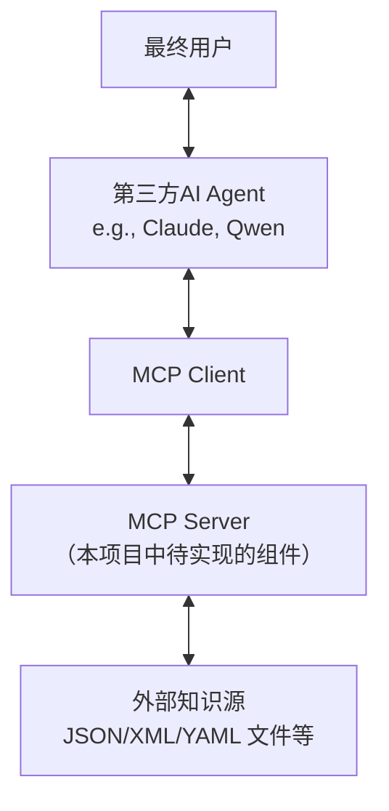

好的，这是根据我们之前的讨论整理的一份需求文档，专为 Coding Agent（或开发人员）实现所述功能的 MCP Server 而编写。

---

# MCP 行业知识引擎需求文档

## 1. 概述

本项目旨在开发一个基于 **Model Context Protocol (MCP)** 的服务器（MCP Server）。该服务器作为一个结构化的行业知识引擎，为第三方 AI Agent（如 Claude Code、Qwen Code 等）提供深度、多轮的专业知识问答能力。MCP Server 本身不具备自然语言生成与理解能力，而是通过高度结构化的输入和输出，引导 Agent 与用户进行有效的交互，从而动态地遍历一个外部定义的知识图谱或决策树。

## 2. 目标

*   **提供深度问答**：突破单轮问答限制，实现针对复杂行业问题的多轮、引导式问答。
*   **与第三方 Agent 协同**：设计协议与接口，使其能够被任何兼容 MCP 的、不可修改逻辑的第三方 Agent 有效调用。
*   **知识外部化**：将行业知识（决策树、知识图谱、提示词）与程序逻辑分离，便于独立维护和更新知识库。
*   **状态管理**：在服务器端维护会话状态，引导问答流程。

## 3. 系统架构与角色



*   **MCP Server**：**本项目的核心交付物**。负责会话管理、状态维护、知识导航，并提供结构化的工具。
*   **第三方 AI Agent**：**不可修改**。负责自然语言交互（理解用户输入、呈现回复给用户）并遵循 MCP 协议调用工具。
*   **外部知识源**：由 MCP 作者创建和维护的静态文件（如 JSON），用于定义决策树、知识节点和内容。

## 4. MCP 工具规范

MCP Server 必须提供以下两个核心工具。

### 4.1. `initiate_session` - 初始化会话

*   **描述**：根据用户的初始查询，创建一个新的咨询会话，并定位到知识库的初始节点。
*   **参数**：
    | 参数名 | 类型 | 必需 | 描述 |
    | :--- | :--- | :--- | :--- |
    | `user_query` | `string` | 是 | 用户提出的原始自然语言问题。 |

*   **返回值** (`SessionState` Object)：
    ```json
    {
      "session_id": "string",        // 唯一会话标识符，由Server生成
      "response": "string",          // 给用户的自然语言回复内容
      "current_step": "string",      // 当前步骤的友好名称（用于调试）
      "options": [                   // 引导用户进行下一步的选项列表
        {
          "id": "string",           // 选项的唯一标识符（英文/数字）
          "description": "string"   // 选项的详细描述（给用户看）
        }
        // ... 其他选项
      ],
      "is_complete": boolean        // 会话是否已结束
    }
    ```
*   **实现逻辑**：
    1.  解析 `user_query`（例如：通过关键词匹配），映射到知识库的根节点或最相关的初始节点。
    2.  生成一个唯一的 `session_id`，并在服务器端保存该会话的初始状态（如 `current_node_id`）。
    3.  从知识库中读取初始节点的内容，填充 `response` 和 `options`。
    4.  返回 `SessionState` 对象。

### 4.2. `navigate_session` - 会话导航

*   **描述**：根据用户在当前步骤的选择，导航知识库，并返回下一步的结构化信息。
*   **参数**：
    | 参数名 | 类型 | 必需 | 描述 |
    | :--- | :--- | :--- | :--- |
    | `session_id` | `string` | 是 | `initiate_session` 返回的会话ID。 |
    | `selected_option_id` | `string` | 是 | 用户从上一个 `options` 列表中选择的选项 `id`。 |
    | `user_input` | `string` | 否 | 用户的补充文本信息（如果适用）。 |

*   **返回值**：与 `initiate_session` 相同的 `SessionState` 对象结构。

*   **实现逻辑**：
    1.  根据 `session_id` 查找服务器端存储的会话状态。
    2.  根据会话状态中的 `current_node_id` 和传入的 `selected_option_id`，查询外部知识库，找到下一个节点。
    3.  更新服务器端的会话状态（`current_node_id`）。
    4.  从知识库中读取新节点的内容，生成新的 `response` 和 `options`。
    5.  判断会话是否应结束（例如：到达叶子节点），设置 `is_complete` 标志。
    6.  返回更新后的 `SessionState` 对象。

## 5. 工作流程

1.  **【Agent】** 收到用户消息。
2.  **【Agent】** 判断是否为全新会话。若是，调用 `initiate_session(user_query)`；若不是，准备调用 `navigate_session`。
3.  **【MCP】** 返回结构化的 `SessionState`。
4.  **【Agent】** 将 `SessionState.response` 内容发送给用户。
5.  **【Agent】** 检查 `SessionState.options`：
    *   如果存在选项，将其呈现给用户（例如：“请选择：1. [description1], 2. [description2] ...”）。
    *   如果 `is_complete` 为 `true`，则结束流程。
6.  **【用户】** 回复 Agent，可能是一个选择（如“1”）或一些自由文本。
7.  **【Agent】** 使用其内在的 LLM 能力分析用户回复：
    *   **主要路径**：将其映射到一个明确的 `selected_option_id`。
    *   **次要路径**：若无法映射，则将用户输入整理为 `user_input` 参数，并通常使用一个特殊的 `selected_option_id`（如 `"provide_more_info"`）来触发 MCP 的特殊处理逻辑。
8.  **【Agent】** 调用 `navigate_session(session_id, selected_option_id, user_input)`。
9.  重复步骤 3-8，直到会话完成。

## 6. 外部知识源设计建议（示例）

知识库可以是一个 JSON 文件，结构如下：

```json
{
  "nodes": {
    "root": {
      "response": "欢迎进行科技行业投资咨询。您想了解哪个细分领域？",
      "options": [
        { "id": "ai", "description": "人工智能(AI)与机器学习", "next_node": "node_ai" },
        { "id": "cloud", "description": "云计算与数据中心", "next_node": "node_cloud" }
      ]
    },
    "node_ai": {
      "response": "AI是一个广阔领域。您对硬件还是软件更感兴趣？",
      "options": [
        { "id": "hardware", "description": "AI硬件（如GPU、专用芯片）", "next_node": "node_ai_hardware" },
        { "id": "software", "description": "AI软件与算法", "next_node": "node_ai_software" }
      ]
    },
    "node_ai_hardware": {
      "response": "AI硬件的代表公司包括NVIDIA、AMD、Intel等。您想了解市场趋势、头部公司还是比较分析？",
      "options": [
        { "id": "trend", "description": "市场趋势与规模", "next_node": "node_ai_hw_trend" },
        { "id": "companies", "description": "头部公司详细介绍", "next_node": "node_ai_hw_companies" },
        { "id": "compare", "description": "公司间对比分析", "next_node": "node_ai_hw_compare" }
      ]
    },
    "node_ai_hw_companies": {
      "response": "以下是主要AI硬件公司的概述：\\n1. NVIDIA: 在GPU领域占据主导地位...\\n2. AMD: 提供竞品GPU和CPU...\\n3. Intel: 专注于CPU并积极进军GPU和AI加速卡市场。",
      "options": [
        { "id": "back", "description": "返回上一级", "next_node": "node_ai" },
        { "id": "end", "description": "结束咨询", "next_node": null }
      ]
    }
    // ... 更多节点
  }
}
```

## 7. 非功能性需求

*   **无状态 Agent**：MCP Server 必须负责维护所有会话状态。
*   **结构化通信**：MCP Server 与 Agent 之间的所有通信必须是机器可读的（JSON），避免依赖自然语言。
*   **知识库可配置性**：知识库的修改不应要求重写 MCP Server 代码。

## 8. 假设与约束

*   第三方 Agent 具备基本的 MCP 客户端功能和 LLM 能力。
*   MCP Server 无需自行生成自然语言，所有回复内容均预定义或从知识库中提取。
*   知识库的规模和组织结构由 MCP 作者负责设计和维护。

---